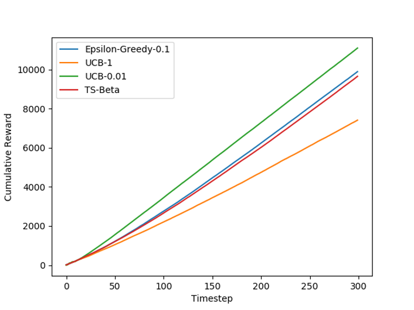
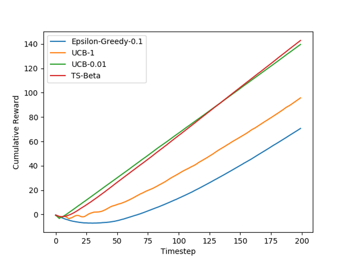
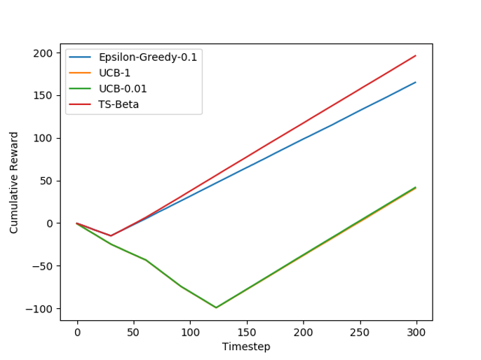

### CS440 Fall 2025

In this assignment you will better understand how to balance exploration and exploitation by implementing some of the most famous and powerful multi-armed bandit algorithms.

First download all the code found in the attached **mabs.zip** file. The codebase contains several files:

**graphs.py** - This is the main file that runs all the bandit algorithms against the environments and generates the graphs. I will be grading with the original file, but for speed when iterating you might want to reduce the envTuples, learnerTuples, or NUM_ITERATIONs.

**environments.py** - This contains several environments in which your bandit algorithms will be tested. Do not change this file.

**learners.py** - This contains all the algorithms for the multi-armed bandit learning algorithms. This is where you will write the code for Q1-Q3.

**distributions.py** - This contains helpful classes representing different types of distributions. Some of these might come in handy when making your learners.

**studentenvironment.py** - For the extra credit, fill this in with either a comment explaining why 0.01 is always better, or construct a counterexample environment. The format of the environment is the same as those in environments.py, you can look at those for examples.

In order to generate graphs, this assignment requires you to have the python module "matplotlib" (and its dependencies such as numpy) installed. The easiest way is for you to use pip, by opening a terminal or command line and typing:

`pip install matplotlib`

If you get some error about "pip not installed", you'll need to give the full path of pip. For me it is under C:\\Python313\\Scripts\\pip, but it could be different on your system.

You run the code with "python graphs.py", or simply running the graphs.py script in your IDE of choice. Note that as generating the graphs takes time, the code may take several minutes to run. The script will generate blank graphs initially, as you have not implemented any algorithms yet.

### General Notes and Hints:

- This is an objected-oriented approach to MABs, therefore all variables that are used to help determine which arm to pull should be stored under **self.**
  - Do not store unnecessary information, for example, the full history of rewards should never need to be stored for any of the algorithms.
- The chooseArm functions should NOT update any variables. Only processReward should do that.
- initWithEnvironment can be used to get information out of the environment, like the number of arms. It should also reset everything, as it is called when I want to run your learner on a new environment.
- Arms are represented by ints starting at 0. Many of the algorithms involve talking the max over arms; if there is a tie, the lowest numbered arm should be chosen. This would probably be the natural way to implement it if you are using a for loop to go through the arms.
- **DO NOT** add any additional imports to the python files. Those listed should be sufficient.
- If you've written some code but can't see the line on the graph, perhaps you forgot to return True from initWithEnvironment?

**Q1.** In learners.py, implement the epsilon-greedy algorithm. (20 points)

_Epsilon-Greedy Note:_

- _The greedy phase selects the best arm out of all those that have been pulled._
- _When e-greedy hasn't gathered any samples yet, there is no need to do the exploitation phase as there is nothing to exploit. So it should always start with the exploration phase until it gets at least one sample._

**Q2.** In learners.py implement the UCB algorithm. (35 points)

_UCB Notes:_

- _Be careful about how you handle delay in the initial phase. UCB should keep pulling the same arm until it gets a reward._
- _In many presentations of UCB, the term t appears. Be very careful as to what this term means in the case of delay._
- _UCB is well-known to fail horribly if its assumptions are not met - you will lose a lot of points if you do not check this carefully._

**Q3.** In learners.py, implement Thompson Sampling with Beta-Bernoulli Priors. (35 points)

_Thompson Sampling Notes:_

- _Prior should be the uniform beta prior discussed in class_
- _You have to be very careful with how you transform rewards in order to retain good performance and regret guarantees. Please use the technique discussed in class._
- _Don't reinvent the wheel, use distributions.py!_

**Q4. (EXTRA CREDIT)** (7 points)

In our test environments, UCB-0.01 always seems (much) better than UCB-1. Is this \*always\* the case? If so, write a comment persuasively explaining why it is always better in studentenvironment.py. If not, in studentenvironment.py, code an environment which will reliably show UCB-1 performing substantially better than UCB-0.01, at least on timesteps 500-1000. Once you fill in a new environment the graph will be generated. If you make a new environment please explain it (as well as why it shows the difference) in a comment.

Style points: 10

Total Points: 100 (plus an optional 7 if you do the extra credit)

**Testing:** No autograder for this one. Instead to help you test you can compare your graphs (generated as pngs in the local directory) to the reference one(s) below. Note that there is always a little noise so results will look very close but not identical. I will give partial credit for small mistakes.

**Assignment Handin** - Please hand in only learners.py (and studentenvironment.py if you attempt the extra credit). You should not need to include any extra files or import any additional libraries to complete the assignment.

**Reference Graphs:**

Gaussian10Arm.png:

Binary5Arm.png:

Delay5Arm.png:

_Note: UCB-1 is a bit hard to see in this last one, but it is overlapping UCB-0.01._
